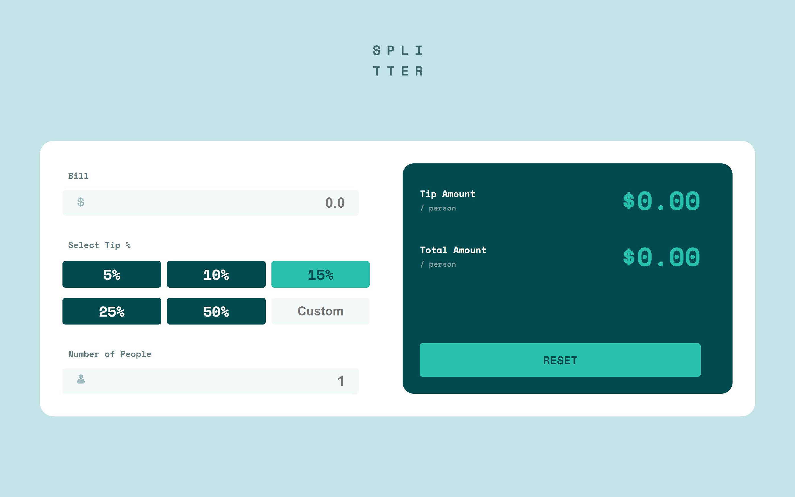

# Frontend Mentor - Tip calculator app solution

This is a solution to the [Tip calculator app challenge on Frontend Mentor](https://www.frontendmentor.io/challenges/tip-calculator-app-ugJNGbJUX). Frontend Mentor challenges help you improve your coding skills by building realistic projects.

## Table of contents

- [Overview](#overview)
  - [The challenge](#the-challenge)
  - [Screenshot](#screenshot)
  - [Links](#links)
- [My process](#my-process)
  - [Built with](#built-with)
  - [What I learned](#what-i-learned)
- [Author](#author)

## Overview

### The challenge

Users should be able to:

- View the optimal layout for the app depending on their device's screen size
- See hover states for all interactive elements on the page
- Calculate the correct tip and total cost of the bill per person

### Links

- Solution URL: [GitHub](https://github.com/AyaElshaer/tip-calculator)
- Live Site URL: [Live Site](https://tip-calculator-ayaramadan.vercel.app/)

## My process

### Built with

- Semantic HTML5 markup
- CSS custom properties
- Flexbox
- CSS Grid
- js Dom
- Dom events

### What I learned

In this project, I learned how to deal with js Dom events and its event handler function using the .addEventListener() method.
writing different events like  'input', ' click' events.

## Author

- Frontend Mentor - [link](https://www.frontendmentor.io/solutions/responsive-page-using-css-flexbox-and-grid-AIQ0FQKFC)

### Screenshot

